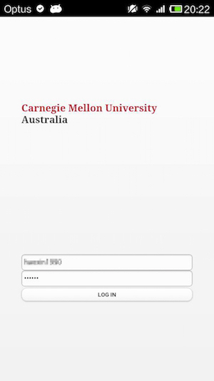
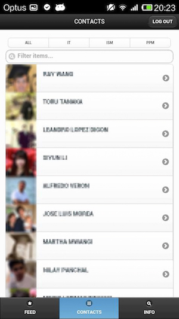

# AtCMU
The AtCMU project includes design and implementation of a mobile application prototype for the campus-wide student social portal @CMU. 

Project scope includes web services developed on top of the Linux-Apache-MySQL-PHP solution stack, 
as well as a cross-platform mobile application built from web technologies (HTML5, CSS, Javascript) using PhoneGap.

This repository hosts the mobile application implementation of project.

## Screenshots

* #####Login

  

* #####Feed

  

* #####Contacts

  

* #####Info

  
  
* #####Contact Detail

  
  
  
## Authors
#####Hsuan-Chih Chuang
